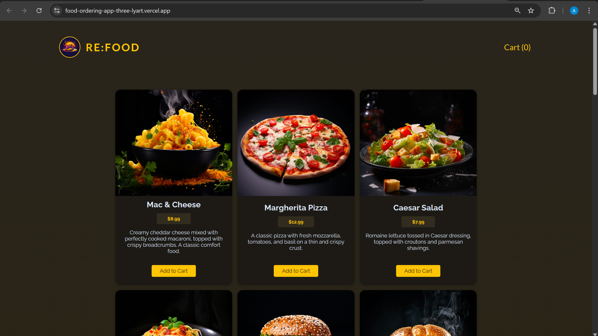
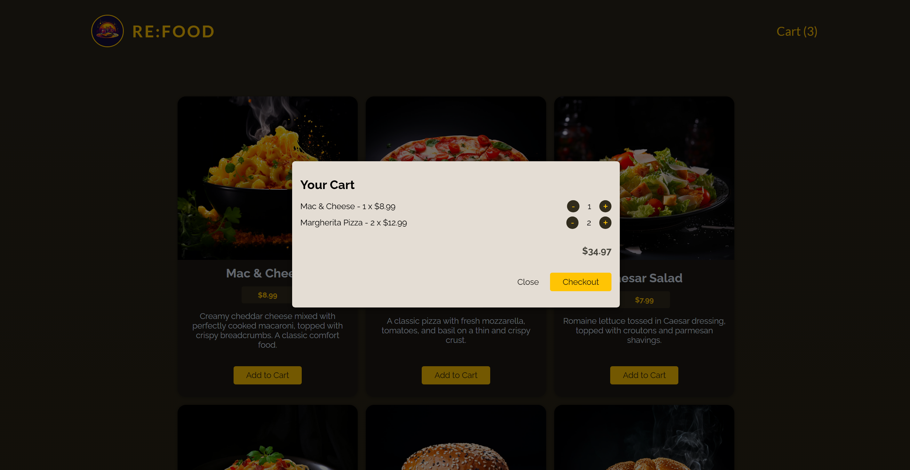
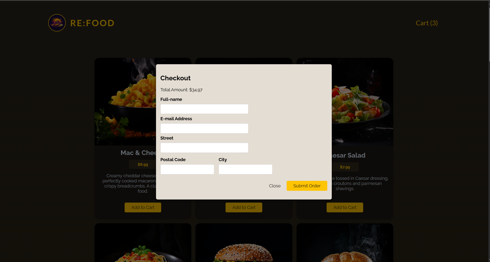
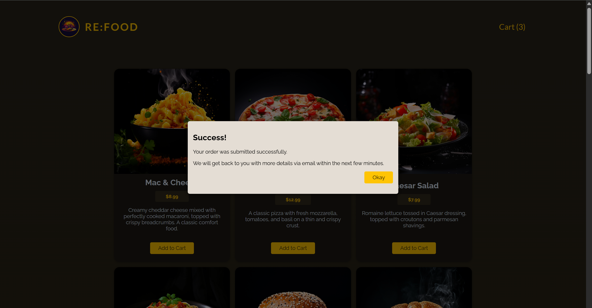

# Food Ordering App

A full-stack food ordering application where users can browse meals, add items to cart, and place orders. The frontend communicates with a production backend API and supports live deployment.

## Live Demo

* Frontend: https://food-ordering-app-three-lyart.vercel.app/
* Backend API: https://food-ordering-app-694h.onrender.com

---

## Features

* Browse dynamic food menu
* Add/remove items from cart
* Cart quantity management
* Checkout form with validation
* Order submission to backend
* Persistent backend data storage
* Static image serving from backend
* Fully deployed (CI/CD enabled)

---

## Screenshots

### Home Page


### Cart


### Checkout


### Order Success


---

## 🔍 Learning Outcomes

* Connected frontend to production backend
* Configured environment variables for deployment
* Implemented CI/CD via GitHub and Vercel
* Debugged real-world deployment problems
  
---

## Tech Stack

**Frontend**

* React (Vite)
* JavaScript
* CSS

**Backend**

* Node.js
* Express.js

**Deployment**

* Frontend: Vercel
* Backend: Render
* GitHub CI/CD integration

---

## Architecture

* Frontend hosted on Vercel
* Backend hosted on Render
* Frontend connects to production backend using environment variables
* Backend serves static images via Express middleware
* REST API used for order handling

---

## Installation (Local Setup)

Clone the repository:

```bash
git clone https://github.com/AnuragSapra/Food-Ordering-App.git
```

### Run Backend

```bash
cd backend
npm install
npm start
```

### Run Frontend

```bash
npm install
npm run dev
```
